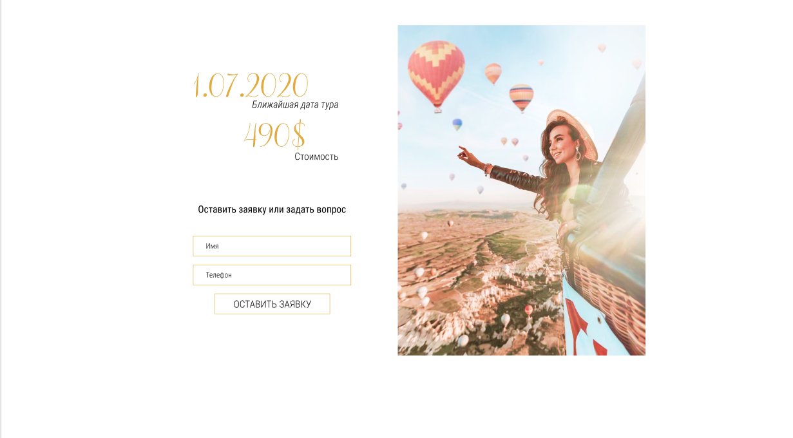
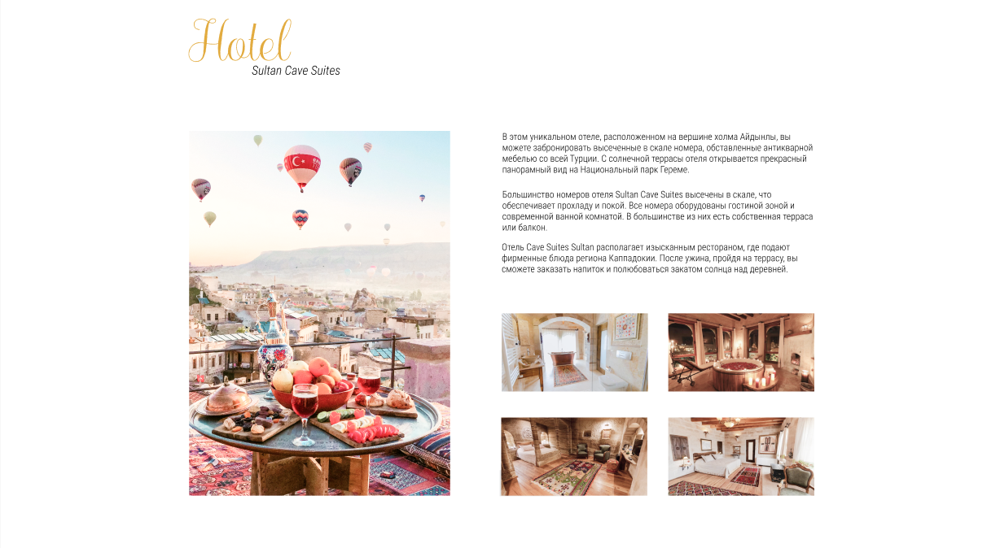

# web
## body

```
.head .head__hair .head__hair--color_black
.body .body__chest .body__chest--tatooed
.arm .arm__finger .arm__finger--ringed
```
<!-- header -->
```
header.header>.header__content.wrapper1200px>.header__navigation-content>nav.header__navigation>ul.header__list>(li.header__item>a.navigation__link)*5^^a.header__phone^.header__main-content>h1.header__logo+p.header__logo-subtitle
```


<!-- form -->

```
section.reply.wrapper1200px>.reply__content>h2.visually-hidden+p.reply__title+p.reply__subtitle+p.reply__title+p.subtitle+p.reply__text+form.reply__form>fieldset.reply__fieldset>(label>input)*2+button.reply__request^^^img
```


<!-- card -->

```
section.hotel>.hotel__heading>h2.hotel__title+p.hotel__subtitle^.hotel__content>img.hotel__image-main+.hotel__content-right>.hotel__text-content>p.hotel__text*3^.hotel__images>img.hotel__image*4
```


<!-- footer -->
```
footer.footer>.wrapper1200px>.footer__content>.footer__baloon>.footer__content>h2.footer__heading+.footer__contacts>a.balloon_contact*2+.balloon_social-networks>(a.balloon_social-network>img)*3^^^^p.footer__text
```
